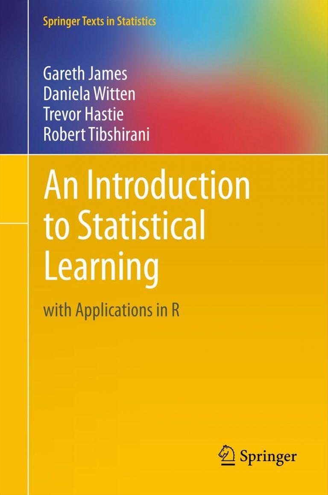

# Introduction to Statistical Learning with Python 
 Python implemented solution to exercises in the "An Introduction to statistical learning with Applications in R" textbook

"Statistical learning is not just about algorithms; it's about curiosity and making sense of data." - Anonymous
"The best way to learn is by doing. Embrace the exercises and dive into the world of statistical learning." - Anonymous

## About this repository 

    The main objective of this repository is to serve as my personal learning log, where I document my progress, insights, and solutions as I work through the book's exercises. As I tackle both conceptual and applied questions, I aim to strengthen and reinforce my statistical intuition and improve my proficiency in applying statistical learning techniques with Python.

## Contents
|       #       |     Title   | Summary |   
|:-------------:|:-----------:|:-------:|
| Chapter 1     |   Introduction | A brief history of statistical learning  |
| [Chapter 2](https://github.com/Oyebamiji-Micheal/Introduction-to-Statistical-Learning-with-Python/tree/main/chapter-2)    |    Statistical Learning    |   Flexible and inflexible statistical learning methods \|Trade-off between accuracy and interpretability

## Disclaimer 
This repo is for learning and self-improvement purposes. The materials, solutions, and content provided here are entirely based on my own understanding and efforts.

1. No Association with the Textbook: This repository is in no way affiliated with the authors or publishers of the textbook "An Introduction to Statistical Learning in R" by Gareth James, Daniela Witten, Trevor Hastie, and Robert Tibshirani. While the repository follows the concepts and exercises from the book, the solutions and explanations are entirely my own.

2. Academic Integrity: I am committed to academic integrity and respect the intellectual property of others. The solutions and implementations in this repository are the result of my own work and understanding of the material.

3. Learning Purposes Only: The materials provided in this repository are intended solely for personal learning, documentation, and educational purposes. They should not be used for any commercial or for-profit activities.

4. No Guarantees: While I strive to provide accurate and reliable information, I make no warranties or guarantees about the correctness, completeness, or suitability of the content in this repository. Use the materials at your own discretion and risk.

5. Attribution: Any external sources, libraries, or code snippets used in the implementations will be properly attributed to their respective authors or creators, as applicable.

6. Exercise Solutions: The exercise solutions provided here are my own interpretations and may not represent the official answers or solutions endorsed by the authors of the textbook.

Lastly, I express my gratitude to the authors of "An Introduction to Statistical Learning in R" for creating such a valuable resource that has inspired my learning journey.

Happy learning!
